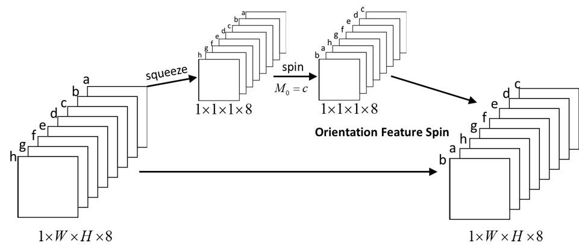
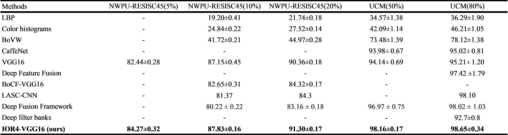

# IORN: An Effective Remote Sensing Image Scene Classification Framework

## Introduction
Improved orientated response network (IORN) is descriped in a [IEEE Geoscience and Remote Sensing Letters paper](https://ieeexplore.ieee.org/document/8434220/).

Remote sensing images captured by satellites, however, usually show varied orientations because of the earth’s rotation and camera angles. This variation increases the difficulties of recognizing the class of a scene. 

Based on orientated response network ([ORN](https://arxiv.org/abs/1701.01833)), we designed Improved orientated response network (IORN).
1.  Based on active rotating filters (ARFs), we propose average active rotating filters (A-ARF), which leads to good convergence and high learning speed without requiring additional computation.
2.  We propose S-ORAlign, which is an improvement of ORAlign. The squeeze layer in S-ORAlign makes it possible for the model to address large-scale remote sensing images. 

## Experimental result

